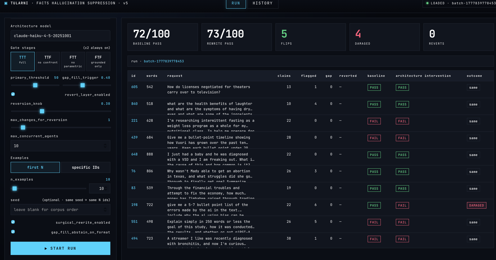

# Tularni — FACTS Demo

 

An interactive demo that reduces ungrounded ("hallucinated") content in LLM responses on the [Google FACTS Grounding benchmark](https://www.kaggle.com/datasets/deepmind/facts-grounding-benchmark). The pipeline gates each atomic claim against the source document, surgically rewrites the response when claims fail, and judges the result against a paper-aligned eligibility panel.

Built to test atomization and reconstruction using some clever confidence scoring pipelines. It is challenging to improve the scoring upon the raw model because the model is very good at detecting when it may get a response wrong but not great at correcting it.  The demo runs locally as a Node/Express server with a vanilla-JS web UI.

**** BE VERY MINDFUL OF TOKEN COSTS. THIS ARCHITECTURE USES MANY CALLS to MODELS FOR EACH QUESTION ******  If you sent N large like a 100 or more you can blow through $100s of token costs in an hour or two.  

---

## What it does

Given a FACTS Grounding example (a context document + a user question), the architecture model produces an answer. That answer is then put through a multi-stage suppression pipeline:

1. **Atomic claim extraction.** Decompose the response into individual factual claims.
2. **Three-stage confidence gate (per claim):** parametric → grounded → confront. Any subset of stages can be toggled on/off (TTT / TTF / FTT / FTF — c2 always on).
3. **Surgical rewrite.** If claims fail the gate, an LLM edits the response in place to remove the unsupported content while preserving the original's bullets, headers, and voice. The rewriter is given the user's question and instructed not to remove the *answer* itself.
4. **Gap-fill.** If too much was removed, identify what's missing relative to the user's question (in scope) and propose grounded fill-in sentences. Survivors get woven back in by a second LLM call that respects the original format.
5. **Reversion.** When edits would be tiny (configurable), or when too many claims fail, the architecture ships the pristine baseline instead — small edits get caught by the strict factuality judge as "the response changed."
6. **Two judges:** a single GPT-5 factuality judge and a 3-model eligibility panel (Gemini 2.5 Pro + GPT-5 + Claude Sonnet) — same setup as the FACTS paper.

The UI shows baseline vs. rewrite verdicts side-by-side; click any row for the full claim trace, gate scores, gap-fill survivors, and judge reasoning.

---

## Setup

Requires Node ≥ 18.

```bash
git clone https://github.com/dan-wellington/facts-grounding-demo.git
cd facts-grounding-demo
npm install
cp .env.example .env
# Fill in your own keys in .env:
#   ANTHROPIC_API_KEY  (Anthropic)
#   OPENAI_API_KEY     (OpenAI)
#   GOOGLE_API_KEY     (Google AI Studio)
npm start
```

Server runs at **http://localhost:3022** by default. Override with `PORT=...` in `.env`.

The `facts_grounding_public.json` corpus (386 examples after filtering to <1000-word contexts) is loaded at startup.

---

## API keys & cost

The demo calls three providers from your account:

| Provider | What it's used for | API key env var |
|---|---|---|
| Anthropic | Architecture model (default `claude-haiku-4-5`), claim extractor, eligibility panelist | `ANTHROPIC_API_KEY` |
| OpenAI | Factuality judge (GPT-5), eligibility panelist | `OPENAI_API_KEY` |
| Google | Eligibility panelist (Gemini 2.5 Pro) | `GOOGLE_API_KEY` |

A typical run with default settings is ~8 model calls per example before judging, plus 4 judge calls — costs scale linearly with `n_examples`. The UI surfaces a "be mindful of token costs!" reminder next to the run config for that reason.

---

## UI parameters

| field | default | meaning |
|---|---|---|
| Architecture model | `claude-haiku-4-5-20251001` | The model under test. The dropdown ships with Haiku as the budget default; the dispatcher in `lib/architectureClient.js` also handles Claude Sonnet/Opus, GPT-5, and Gemini 2.5 Pro by model-id prefix if you add them back to the dropdown. |
| Gate stages | TTT (full) | Which of c1 (parametric), c2 (grounded), c3 (confront) run. c2 always on. |
| `primary_threshold` | 50 | A claim is flagged if the rightmost-enabled stage's confidence is below this (0–100). |
| `gap_fill_trigger_threshold` | 0.40 | Run gap-fill only if `n_sentences_dropped / n_total > this`. |
| `revert_layer_enabled` | on | Whether to use the reversion safety net at all. |
| `reversion_knob` | 0.30 | Higher = more reverts. Internally: revert when `flag_ratio > (1 − knob)`. 0 = never revert by ratio, 1 = revert if anything is flagged. |
| `max_changes_for_reversion` | 1 | Ship baseline (skip rewrite) when `n_flagged ≤ this`. Tiny edits trip the factuality judge as "the response changed" even when content is intact, so small-flag cases pass through. |
| `surgical_rewrite_enabled` | on | When off, falls back to mechanical claim-fragment concatenation. |
| `gap_fill_abstain_on_format` | on | When the baseline is in a tight format (1–2 bullets or <30 words), skip gap-fill — adding bullets would violate the user's implied format constraint. |
| `max_concurrent_agents` | 10 | Examples processed in parallel inside one batch run. |

---

## Project layout

```
server.js                      Express + SSE + run orchestration
lib/
  pipeline.js                  Per-example orchestrator (steps 1–6)
  architectureClient.js        Multi-provider dispatcher (claude-* / gpt-* / gemini-*)
  anthropicClient.js
  openaiClient.js
  geminiClient.js
  extractor.js                 Sonnet-pinned atomic-claim extraction
  gate.js                      c1/c2/c3 confidence gate (TTT/TTF/FTT/FTF)
  rewriter.js                  Surgical claim removal (question-aware)
  gap_fill.js                  Gap analyzer + per-gap fill generator
  reinsert.js                  Surgical reinsertion of gap-fill survivors
  concat.js                    Legacy mechanical concat (fallback path)
  judge.js                     GPT-5 factuality judge
  eligibilityPanel.js          3-model eligibility panel (cached)
  jsonExtract.js               Robust LLM-output JSON parser
  metrics.js
public/
  index.html                   UI markup
  app.js                       UI logic + SSE consumer
  styles.css                   Theme
facts_grounding_public.json    Google FACTS Grounding public release
.env.example                   Copy to .env and fill in keys
```

`runs/` is created on first use and contains per-run JSONL records + meta. Excluded from version control.

---

## How the pipeline handles tricky cases

The architecture has been tuned against several known failure modes:

- **Counting / aggregation questions** ("how many X excluding Y?") — the gate's c2/c3 prompts include an aggregation exception so claims like "2 additional flavors excluding Authentic" pass when the document literally enumerates the items.
- **Format-constrained user requests** ("answer in one bullet") — gap-fill abstains when the baseline is short or has ≤2 bullet items, so the architecture doesn't violate format by appending a new bullet.
- **Question-essential claims being removed** — surgical rewrite receives the user's question and runs an "answer-essentiality check" before deciding what to remove. A flagged claim that *is* the answer to the question stays.
- **Judge non-determinism** — when the rewrite is bit-identical to the baseline (any reversion path), the architecture reuses the baseline's verdicts instead of re-judging — eliminates spurious "Inaccurate after revert" verdicts caused by GPT-5's non-deterministic temp=0 sampling.
- **Cost** — the gate's c1/c2/c3 prompts emit confidence-only output (no chain-of-thought reasoning text) for ~95% reduction in gate output tokens.

---

## Data and license

The benchmark data file `facts_grounding_public.json` is from Google DeepMind's public FACTS Grounding release. See [the dataset card](https://www.kaggle.com/datasets/deepmind/facts-grounding-benchmark) for its license terms.

This demo's source code is MIT-licensed (see `LICENSE`).
